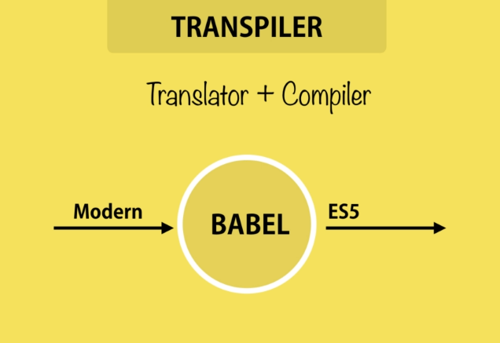
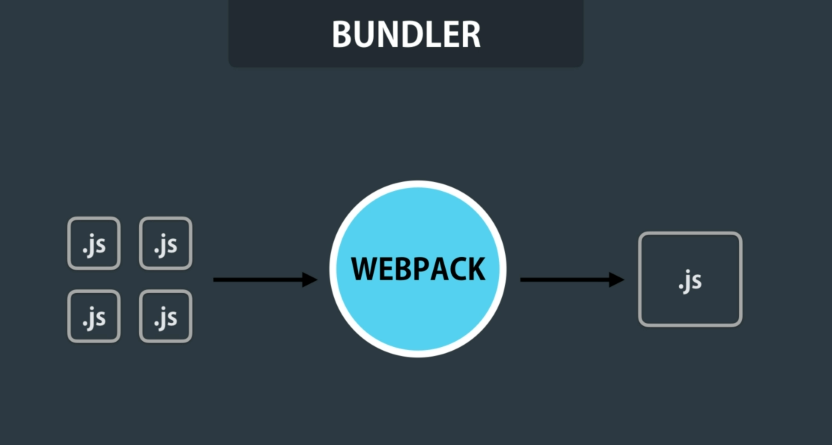

# ES6 Tooling

When using modern JavaScript, you need **two important tools**—but **only if you're building browser-based applications**. If you're working with JavaScript in Node.js, these tools are usually not necessary.

### 1. Transpiler

A **transpiler** _(short for transformation compiler (transformation + compiler ))_ is a tool that takes your modern JavaScript code (using ES6+ features) and **converts it into older JavaScript** that is compatible with all major browsers.

A popular transpiler for JavaScript is **Babel**. It ensures that new syntax like arrow functions, let/const, async/await, etc., will still work in browsers that don’t support them yet.

### 2. Bundler

A **bundler** is responsible for **combining all your JavaScript files into a single file**, known as a bundle.

One of the most widely used bundlers is **Webpack**. When you pass your JavaScript files to Webpack:

- It merges them into a single bundle.

- It removes unnecessary white spaces and comments.

- It uglifies the code—meaning it shortens names of variables, functions, and classes to reduce file size.

This helps in reducing the size of the final JavaScript file that is sent to the client, making the web application load faster.

